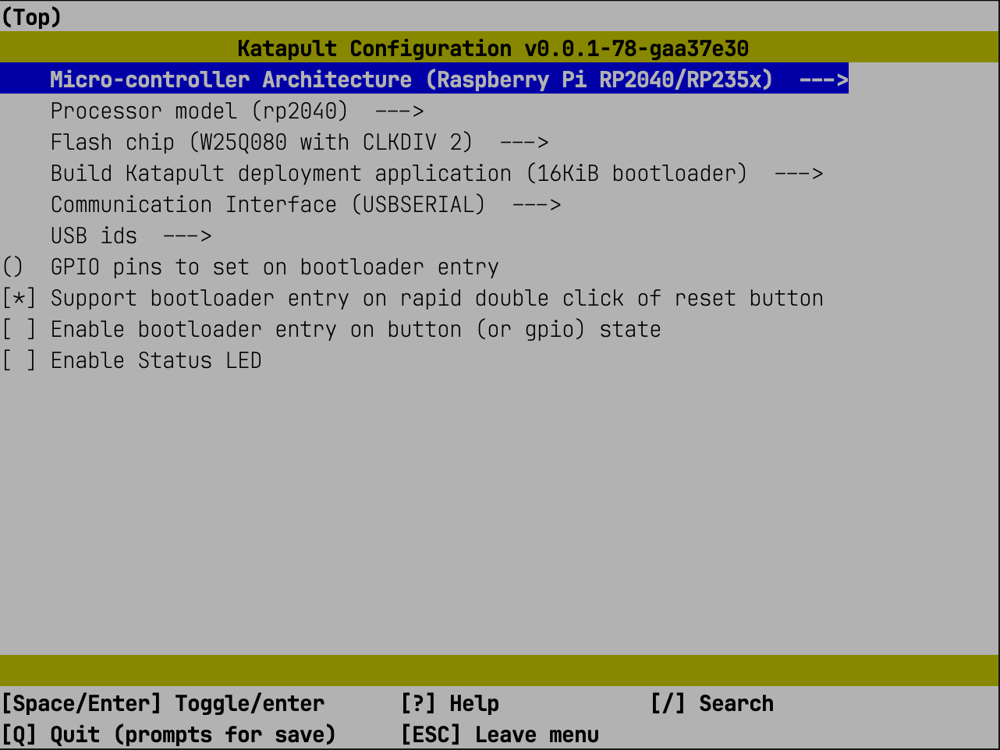
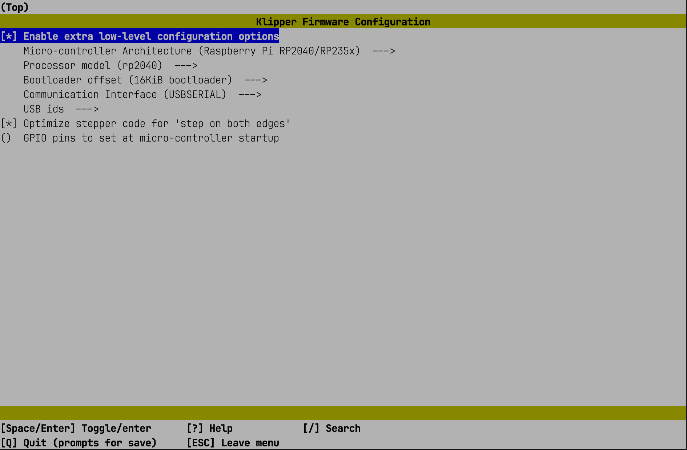

# Установка прошивки

## Установка Katapult

```
git clone https://github.com/Arksine/katapult
```

### Подготовка прошивки Katapult

```
cd katapult
make menuconfig
```
Выберите следующие параметры.



**Важно:** Перед загрузкой прошивки убедитесь, что конфигурация сборки Katapult выбрана правильно. Перезапись существующего загрузчика некорректной сборкой приведёт к "окирпичиванию" устройства и потребует программатор для восстановления.

### Сборка прошивки Katapult

```
make
```

### Подключение микроконтроллера Unit в режиме BOOT

Переведите ваш микроконтроллер в режим BOOT, нажмите и удерживайте BOOT, кратковременно нажмите RESET, отпустите BOOT. Или, при отключенном USB зажмите BOOT, подключите USB, отпустите BOOT

### Определение ID микроконтроллера

```
lsusb
```

Вы увидите что-то подобное:
```
Bus 001 Device 004: ID 2e8a:0003 Raspberry Pi RP2 Boot
```

### Прошивка микроконтроллера по ID

```
make flash FLASH_DEVICE=2e8a:0003
```

---
## Установка прошивки Klipper
### Подготовка прошивки Klipper

```
cd ~/klipper/
make clean
make menuconfig
```

Выберите следующие параметры.



#### Сборка прошивки Klipper

```
make
```

### Получение серийного ID микроконтроллера

Переподключайте USB несколько раз, или нажимайте RESET если нужно, пока устройство не появится.

```
ls /dev/serial/by-id/*
```

Вы увидите что-то похожее на:
```
/dev/serial/by-id/usb-katapult_rp2040_XXXXXXXXXXXXXXXX-XXXX
```

### Установка необходимой Python-библиотеки

```
pip3 install pyserial
```

### Прошивка Klipper через Katapult

```
cd ~/katapult/scripts
python3 flashtool.py -d usb-katapult_rp2040_XXXXXXXXXXXXXXXX-XXXX
```

Введите 
```
ls /dev/serial/by-id/*
```
В случае успешной прошивки ID будет содержать "Klipper":
```
/dev/serial/by-id/usb-Klipper_rp2040_XXXXXXXXXXXXXXXX-XXXX
```
