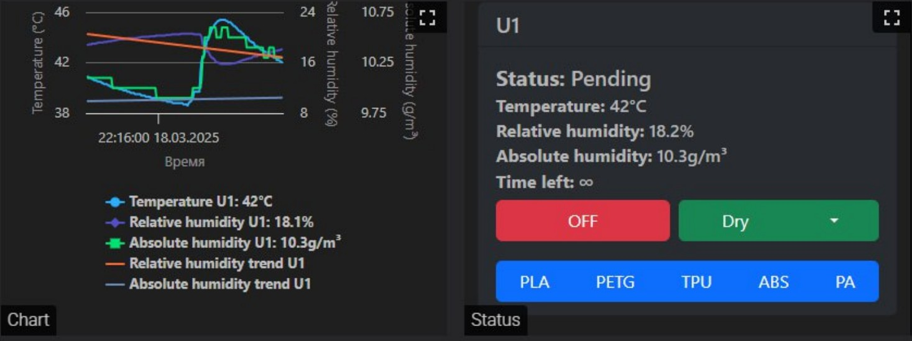

## **Руководство пользователя по настройке iDryer Unit**

### ⚠ Внимание! Работы с электрооборудованием повышенной опасности ⚠
Перед началом работы внимательно ознакомьтесь с мерами безопасности!

iDryer Unit содержит компоненты, работающие под высоким напряжением (220 В), а также открытые нагревательные элементы. Неправильное подключение или эксплуатация может привести к поражению электрическим током, возгоранию или выходу устройства из строя.


### **Подготовка к сборке**
Перед началом сборки необходимо выполнить следующие шаги:
- Убедиться в наличии всех комплектующих.
- Проверить подгонку всех деталей, особенно сопряжение движущихся частей.
- Убедиться в плавности и равномерности движения всех подвижных механизмов.

### **Предварительная проверка системы**
Рекомендуется сначала собрать всю систему **на столе**, без монтажа в корпус, и провести тестирование:
- Подключить все компоненты.
- Проверить работоспособность нагревателя, вентилятора, сервопривода заслонки и датчиков температуры.
- Подключить систему к **Klipper** и убедиться в корректной работе макросов.

После успешного тестирования можно монтировать комплектующие в корпус.
При финальной сборке укоротите провода датчиков и питания до минимально необходимой длины. 

---

## **Финальная настройка системы**
### **Калибровка PID-регулятора нагревателя**
Перед эксплуатацией необходимо откалибровать **PID-регулятор** нагревателя.

- **Рекомендуемая температура сушки**: **90°C**.
- В конфигурации `iDryer.cfg` уже есть предварительные настройки PID, но рекомендуется провести **автокалибровку** для адаптации к конкретной системе.
  
**Калибровка:**

При закрытой крышке сушилки:
1. Открыть консоль Klipper.
2. Выполнить команду:
   ```
   PID_CALIBRATE HEATER=iDryer_U1_Heater TARGET=100
   ```
3. Дождаться завершения калибровки.
4. Записать полученные коэффициенты **Kp, Ki, Kd** в конфиг iDryer.cfg.

Пример секции нагревателя в `iDryer.cfg`:
```ini
[heater_generic iDryer_U1_Heater]
heater_pin: H_U1
max_power: 1
sensor_type: NTC 100K MGB18-104F39050L32
sensor_pin: T_U1
control: pid
pwm_cycle_time: 0.3
min_temp: 0
max_temp: 125
pid_Kp=29.625
pid_Ki=0.945
pid_Kd=232.186
```

---

### **Настройка параметра "variable_delta_high"**
Переменная `variable_delta_high` управляет разницей температур между нагревателем и камерой.

- **Начальное значение variable_delta_high:** 15°C
- Для корректной настройки:
  1. Установить `variable_delta_high=15`.
  2. Включить нагрев макросом `PA_U1`.
  3. Дождаться выхода температуры нагревателя на плато.
  4. Проверить температуру в камере:
      - **Если в камере 90°C** – необходимо оставить текущее значение `variable_delta_high`.
      - **Если температура ниже** – необходимо увеличить `variable_delta_high`.
  5. Для тестирования оставить сушилку работать **30 минут**, затем проверять состояние нагревателя **каждые 30–60 минут**.

**Важно!**  
Если нагреватель **прилипает к пластику**, значит, пластик не выдерживает температуру – необходимо снизить `variable_delta_high` перепечатать корпус други филаментом или изменить конструкцию крепления нагревателя.

**Отключение нагрева** - макрос OFF_U1

---

### **Настройка сервопривода заслонки**
Сервопривод управляет вентиляцией сушильной камеры.  

#### **Основные принципы работы серво**
- Серво управляется **ШИМ-сигналом**.
- Разные сервоприводы могут по-разному реагировать на одно и то же "ШИМ-значение".
- Настройка сервопривода должна быть **индивидуальной**.

#### **Настройка крайних положений заслонки**
1. **Не прикручивать заслонку к корпусу на первом этапе настройки**.
2. Определить **максимальные и минимальные** углы вращения серво:
   ```
   SET_SERVO SERVO=srv_U1 ANGLE=0
   ```
   ```
   SET_SERVO SERVO=srv_U1 ANGLE=90
   ```
3. Если серво упирается в корпус – скорректировать диапазон.

#### **Настройка в конфигурации**
В файле `iDryer.cfg` настроить:
```ini
[servo srv_U1]
pin: SRV_U1
maximum_servo_angle: 180
minimum_pulse_width: 0.00055
maximum_pulse_width: 0.002
```
Скорректировать значения углов variable_servo_open_angle и variable_servo_closed_angle : 

```
[gcode_macro DRY_U1]
variable_temp: 5
variable_humidity: 5
variable_duration: 5
variable_delta_high: 30
variable_servo_angle: 0
variable_servo_open_angle: 40 #degrees
variable_servo_closed_angle: 94 #degrees
variable_servo_open_time: 10 #second
variable_servo_closed_time: 300 #second
variable_data: {}
```

---

### **Коррекция питания сервопривода**
Если используется несколько сервоприводов и возникают проблемы, рекомендуется воспользоваться **активным USB-хабом**.

Решение:
1. **Ограничение тока через резистор**  
   - Установить **резистор 7.5–15 Ом** в разрыв питания серво.
   - Это поможет снизить пиковую нагрузку на USB порт хоста.
2. **Использование активного хаба**  
   - Подключение через USB-хаб с отдельным питанием поможет избежать перегрузки хост-системы.

---

## **Дополнительные рекомендации**
- Контролируйте показания температуры и влажности через Klipper.
- Следите за состоянием компонентов в процессе работы.
- При необходимости доработайте крепления заслонки и нагревателя.

---

### **Примеры команд для работы с сушилкой**
- **Выключение сушки**:
   ```gcode
   OFF_U1
   ```
- **Запуск сушки для ABS**:
   ```gcode
   ABS_U1
   ```
- **Запуск сушки для PLA**:
   ```gcode
   PLA_U1
   ```
- **Открыть заслонку вручную**:
   ```gcode
   SET_SERVO SERVO=srv_U1 ANGLE=90
   ```

---

### **Заключение**
Настройка iDryer Unit требует внимательной подгонки параметров PID, `variable_delta_high` и работы сервопривода. Если всё настроено правильно, система будет работать стабильно и эффективно, обеспечивая качественную сушку пластика.

### Альтернативный вариант алгоритма управления процессами

High End вариант от @Xatang
      
Автоматическое поддержание оптимальных параметров сушки и хранения с возможностью изменения базовых переменных и коэффициентов и информативными графиками



[Перейти в репозиторй проекта на GitHub](https://github.com/xatang/PyUnit)


      
### Общие меры предосторожности:
Отключайте устройство от сети перед любыми работами.

Не прикасайтесь к открытым токоведущим частям.

Проверяйте целостность проводки перед включением.

Не эксплуатируйте готовое устройство с поврежденным корпусом или оголенными проводами.

Не оставляйте устройство без присмотра во включенном состоянии.

Обеспечьте надежное заземление всех металлических частей корпуса.

При обнаружении запаха гари, дыма или нагрева корпуса выше нормы – немедленно отключите устройство от сети.

Избегайте попадания влаги и конденсата на элементы устройства.

**Дополнительные требования к подключению:**

Используйте автоматический выключатель или реле защиты от перегрузки.

Все соединения должны быть выполнены с соблюдением электрической изоляции.

Нарушение данных правил может привести к серьезным последствиям для жизни и здоровья!

При отсутствии опыта работы с электрооборудованием обратитесь к квалифицированному специалисту.


### Если остались вопросы:

## Связь и поддержка

[](https://t.me/iDryer)
[](https://www.youtube.com/@iDryerProject)
[](https://github.com/pavluchenkor/iDryer-Unit)
[](https://discord.gg/1332280943465201724)
